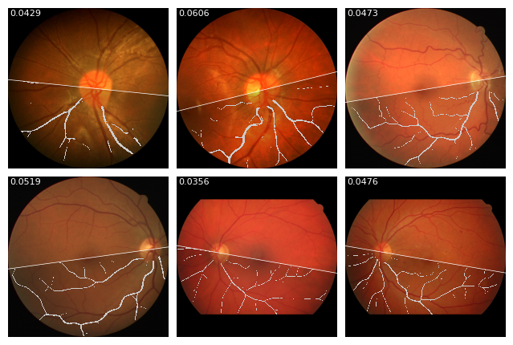
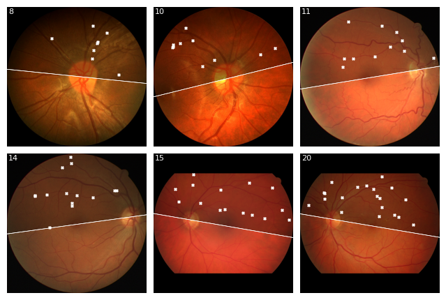
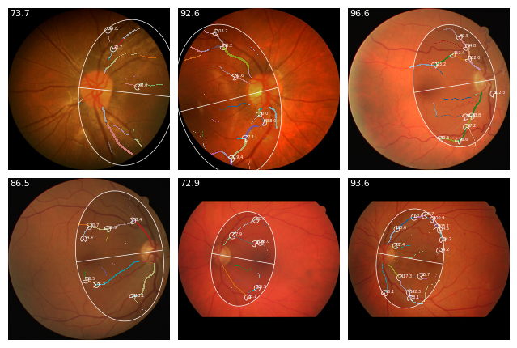
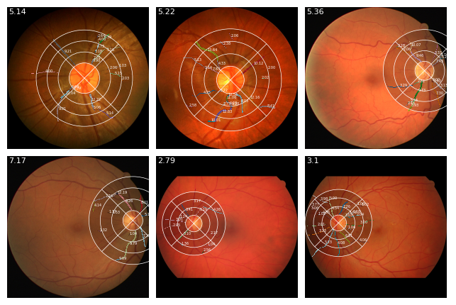
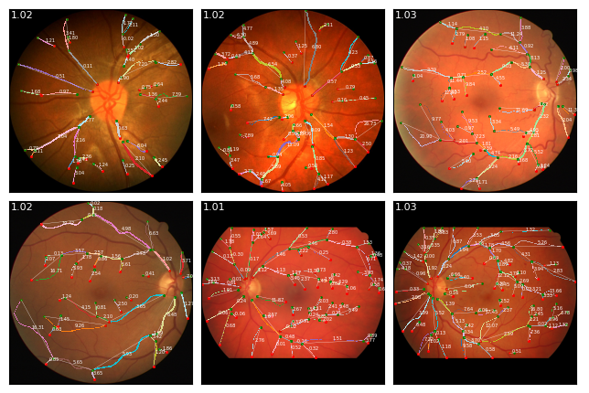
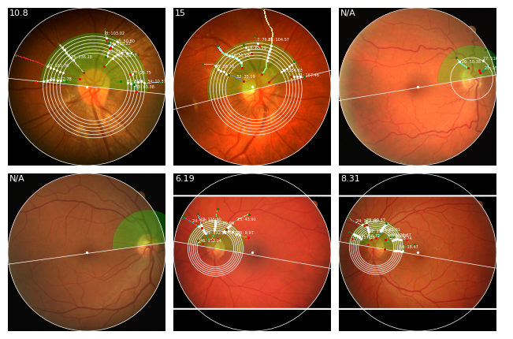
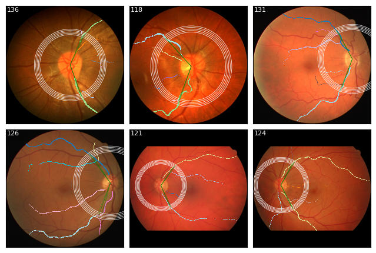
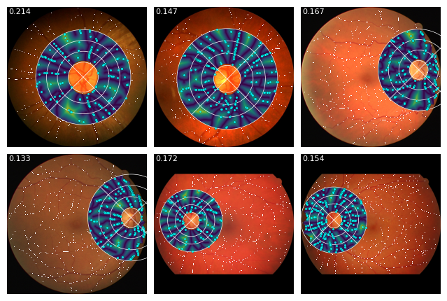

## VascX retinal vascular analysis

VascX was created to facilitate the extraction of retinal vascular biomarkers from color fundus image (CFI) segmentations. The instructions in this repository explain how to run the entire pipeline, which has two main parts:
- **CFI Segmentation.** Extraction of optic disc, vessels and artery vein segmentation and fovea locations. The code for model inference and model weights are in the [models repository](https://github.com/Eyened/rtnls_vascx_models).
- **Biomarker computation.** Extraction of biomarkers from the segmentations. The code for biomarker computation is in this repository.

If you use VascX, please consider citing our open access papers / preprints:
- [VascX Models: Deep Ensembles for Retinal Vascular Analysis From Color Fundus Images](https://tvst.arvojournals.org/article.aspx?articleid=2810436)
Vargas Quiros, J. D., Liefers, B., van Garderen, K. A., Vermeulen, J. P., & Klaver, C. C. W. (2025). VascX Models: Deep Ensembles for Retinal Vascular Analysis From Color Fundus Images. Translational Vision Science & Technology, 14(7), 19-19.

- [retinalysis-vascx: An explainable software toolbox for the extraction of retinal vascular biomarkers](https://arxiv.org/abs/2602.08580)
Vargas Quiros, J. V., Beyeler, M. J., Vela, S. O., Center, E. R., Bergmann, S., Klaver, C. C. W., & Liefers, B. (2026). retinalysis-vascx: An explainable software toolbox for the extraction of retinal vascular biomarkers. arXiv preprint arXiv:2602.08580.

### Installation

To install the entire fundus analysis pipeline including fundus preprocessing, model inference code and vascular biomarker extraction:

1. Create a virtual environment, or otherwise ensure a clean environment.

2. Install VascX:

```
pip install retinalysis-vascx
```

### Usage

To speed up re-execution of VascX we recommend to run the segmentation and feature extraction steps separately:

To run on the provided samples folder in our git repository:

```
git clone git@github.com:Eyened/retinalysis-vascx.git rtnls_vascx
cd rtnls_vascx
vascx run-models ./samples/fundus/original/ /path/to/segmentations
vascx calc-biomarkers /path/to/segmentations /path/to/features.csv --feature_set full --n-jobs 8 --logfile /path/to/logfile.txt
```

Note that `vascx run-models` will write segmentations and other model predictions to `/path/to/segmentations`, which will have the following structure:

```
/path/to/segmentations
  - preprocessed_rgb/ - preprocessed fundus images
  - artery_vein/ - artery-vein model segmentations
  - vessels/ - vessel model segmentations
  - disc/ - optic disc model segmentations
  - overlays/ - optional overlays showing the segmentations
  - bounds.csv - contains the bounds of the fundus image
  - fovea.csv - model predictions of the fovea locations for each image
  - quality.csv - model estimations of CFI quality
```

The folders above will contain images with matching filenames.


We also provide notebooks for running the three stages:

1. Preprocessing. See [this notebook](./notebooks/0_preprocess.ipynb). This step is CPU-heavy and benefits from parallelization (see notebook).

2. Inference. See [this notebook](./notebooks/1_segment_preprocessed.ipynb). All models can be ran in a single GPU with >10GB VRAM.

3. Feature extraction. See [this notebook](./notebooks/2_feature_extraction.ipynb). This step is CPU-heavy again and benefits from parallelization (see notebook).


### Implementation


VascX processes vessel segmentations through four main stages, each producing different data representations:

- **Input masks**: `np.ndarray[bool]` per layer; optic disc and fovea metadata from segmentation models.

- **Stage 1 - Binary/skeleton**: 
  - `binary`: filled vessel mask after disc masking
  - `binary_nodisc`: vessel mask without disc region
  - `skeleton`: skeletonized vessel centerlines using skimage skeletonization

- **Stage 2 - Undirected graph**: 
  - NetworkX `Graph` with skeleton pixels as nodes
  - `Segment` objects stored on edges containing skeleton points and geometric properties
  - Each segment represents a vessel segment between junction points

- **Stage 3 - Directed digraph**: 
  - NetworkX `DiGraph` with flow direction from optic disc outward
  - `trees`: root nodes representing vessel trees emanating from disc
  - `nodes`: `Endpoint` and `Bifurcation` objects with spatial positions
  - `segments`: directed vessel segments with computed properties (diameter, length, etc.)

- **Stage 4 - Resolved vessels**: 
  - Merged vessel graph after running vessel resolution algorithm
  - `resolved_segments`: final vessel segments after merging short segments
  - Segment-to-pixel mapping for spatial feature computation

Biomarker families use different representations: mask-based features use `binary`; topology features use `digraph` and `nodes`; morphological features use `segments` with computed diameters; spatial features use segment-to-pixel mappings.

### Biomarkers

VascX computes retinal vascular biomarkers from standardized representations (binary masks, undirected/directed graphs, resolved vessels). Below we describe each feature with the exact quantity being estimated and the equations used. Throughout, B denotes the stage‑1 binary vessel mask, S the set of eligible directed segments with lengths \(\ell_i\), and R an analysis region of interest; cardinalities count pixels, and distances are in pixels unless noted.

**VascularDensity.** The fraction of retinal area occupied by vessels in R, computed on the binary mask B:

$$
D \,=\, \frac{|B \cap R|}{|R|}.
$$



**BifurcationCount.** The count of branching points in the directed graph (stage‑3). Let $\mathcal{B}$ be the set of bifurcation nodes with positions $p_b$:

$$
C \,=\, \sum_{b \in \mathcal{B}} \mathbf{1}[p_b \in R].
$$



**BifurcationAngles.** For each bifurcation $b$ at position $p_b$, outgoing branch directions are estimated by sampling the branches' splines at distance $\delta$ from the node along each branch at points $q_1$ and $q_2$. Unit vectors $(u_b, v_b)$ are defined from the bifurcation point to the sample points:

$$
u_b = \frac{q_1 - p_b}{\|q_1 - p_b\|}, \quad v_b = \frac{q_2 - p_b}{\|q_2 - p_b\|},
$$

and the bifurcation angle is defined as the angle between these vectors:

$$
\theta_b \,=\, \arccos(u_b \cdot v_b), \quad \theta_b \in [0^\circ, 180^\circ].
$$

Angles exceeding 160° are discarded as non-bifurcating continuations. Summary statistics (e.g., mean/median) are reported across valid nodes.



**Caliber.** For each segment $i$, diameters are sampled along a spline fitted to its skeleton by projecting spline normals to the vessel boundary on B. The per‑segment diameter is the median along its arclength. The reported caliber aggregates over eligible segments (length $\ell_i \ge \ell_{\min}$):

$$
\operatorname{Caliber} \,=\, g\big(\{ d_i : i \in S \}\big),
$$

where \(g\) is a robust statistic (typically the median).



**Tortuosity.** Three complementary measures are provided per segment (or per resolved vessel). Let $L_{\text{arc},i}$ be arclength and $L_{\text{chord},i}$ the end‑to‑end Euclidean distance.

- Distance factor:

$$
T_i^{\text{DF}} \,=\, \frac{L_{\text{arc},i}}{L_{\text{chord},i}}.
$$

- Curvature‑based measure, using planar curvature $\kappa_i(s)$ and OD–fovea distance $d_{ODF}$ for scale normalization:

$$
T_i^{\kappa} \,=\, \frac{1}{L_{\text{arc},i}} \int_0^{L_{\text{arc},i}} \big|\kappa_i(s)\big| \, ds \; \cdot \; d_{ODF}.
$$

- Inflection count (number of curvature sign changes along the centerline):

$$
T_i^{\text{INF}} \,=\, N^{(i)}_{\text{inflections}}.
$$

When reporting a single score over multiple segments, length‑weighted aggregation may be used for normalization:

$$
T_{\text{tot}} \,=\, \sum_{i \in S} \left( \frac{\ell_i}{\sum_{j \in S} \ell_j} \right) t_i,
$$

with $t_i$ any of the measures above.



**CRE (Central Retinal Equivalents).** Concentric circles centered at the optic disc are intersected with the vessel network. At each radius $r$, up to $M$ crossings with the largest segment median diameters are retained and recursively reduced via the Hubbard rule with a modality‑dependent constant $c$ (arteries: 0.88; veins: 0.95):

$$
 d \leftarrow c\,\sqrt{d_1^2 + d_2^2}
$$

applied pairwise until a single equivalent caliber $d_r$ remains. The final CRE is the median of $\{d_r\}$ across radii.



**TemporalAngle.** On each concentric circle of radius \(r\), the two dominant temporal vessels are identified by diameter and spatial continuity. The angle at the disc center is

$$
\theta_r \,=\, \angle\big(\overline{OD\,p_1(r)},\, \overline{OD\,p_2(r)}\big),
$$

and the reported value is the median over radii.



**Sparsity.** Let $\mathrm{DT}(x)$ represent the distance transform over $R$, ie. the normalized Euclidean distance to the nearest vessel pixel (scaled by $d_{ODF}$). Over pixels in R we report either the mean or the largest local maximum:

$$
S_{\text{mean}} \,=\, \frac{1}{|R|} \sum_{x \in R} \mathrm{DT}(x), \qquad
S_{\max} \,=\, \max_{x \in R \cap \text{local maxima}} \mathrm{DT}(x).
$$



**VarianceOfLaplacian.** For the fundus image $I$ (grayscale), compute the discrete Laplacian $L = \Delta I$. Image sharpness is summarized as the variance over R:

$$
\operatorname{Var}\{ L(x) : x \in R \}.
$$

**DiscFoveaDistance.** With optic disc center $c_{OD}$ and fovea position $p_f$,

$$
 d_{ODF} \,=\, \lVert c_{OD} - p_f \rVert_2.
$$


### Feature localisation

VascX localises feature computations using anatomical references and predefined grids:

- **Anatomical anchoring**
  - The optic disc mask and fovea position orient geometry (e.g., OD–fovea axis) and define a retinal mask.
  - All region masks are intersected with the retinal mask; features operate only on visible retina.

- **Predefined grids** (`rtnls_enface/rtnls_enface/grids`)
  - `EllipseGrid`: ellipse centered midway between disc and fovea, major axis along OD–fovea. Fields: `FullGrid`, `Superior`, `Inferior`.
  - `CircleGrid`: disc–fovea–centered circle (radius derived from OD–fovea distance and disc size). Fields: `FullGrid`, `Superior`, `Inferior`.
  - `ETDRSGrid`: classic ETDRS layout with rings (`Center`, `Inner`, `Outer`), quadrants (`Superior`, `Inferior`, `Nasal`, `Temporal`, plus `Left`/`Right`), and subfields (`CSF`, `SIM`, `NIM`, `TIM`, `IIM`, `SOM`, `NOM`, `TOM`, `IOM`).
  - `HemifieldGrid`: superior/inferior half-planes split relative to the OD–fovea axis. Fields: `FullGrid`, `Superior`, `Inferior`.
  - `DiscCenteredGrid`: disc-anchored rings (`inner`, `center`, `outer`) and quadrants (`superior`, `inferior`, `nasal`, `temporal`, plus `left`/`right`), taking laterality into account.

- **Bounds and visibility (CFI bounds)**
  - For a chosen field, the platform evaluates the fraction within bounds using `grid_field_fraction_in_bounds` (and `grid_field_masks_and_fraction`).
  - If the fraction in-bounds is too small (typically < 0.5), many features skip computation and return `None` to avoid out-of-frame bias.
  - Visualizers plot the requested field overlayed on the image; computations always respect in-bounds masking.

Ready-to-run feature sets are available under `vascx/fundus/feature_sets` (e.g., `full`, `bergmann`, `quality`) and can be selected by name when using `extract_in_parallel`. To generate feature descriptions alongside extraction:

Ready-to-run feature sets are available under `vascx/fundus/feature_sets` (e.g., `full`, `bergmann`, `quality`) and can be selected by name when using `extract_in_parallel`. To generate feature descriptions alongside extraction:

```python
df = extract_in_parallel(examples, "full", n_jobs=8, descriptions_output_path="feature_descriptions_full.txt")
```


