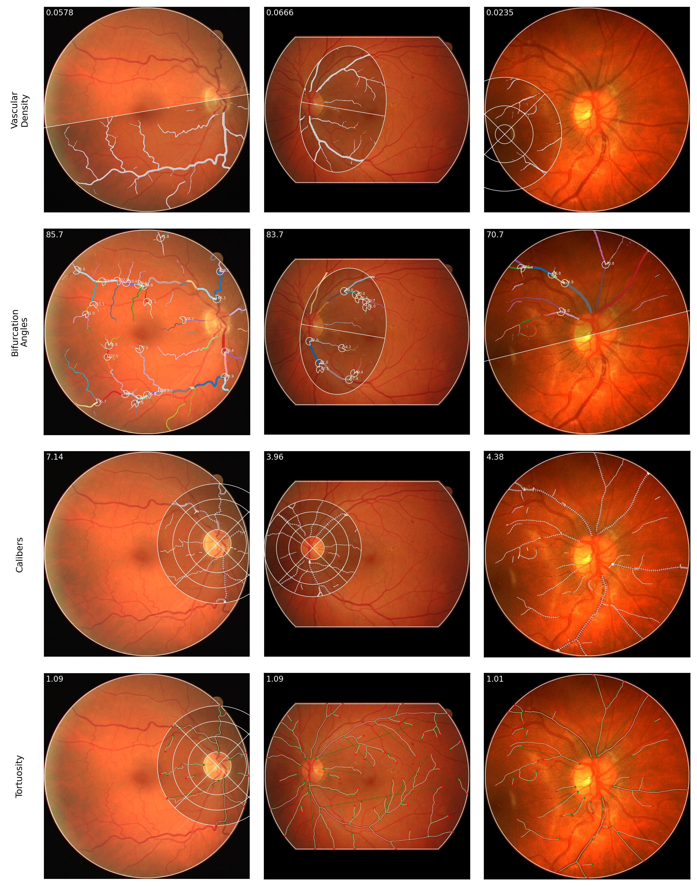
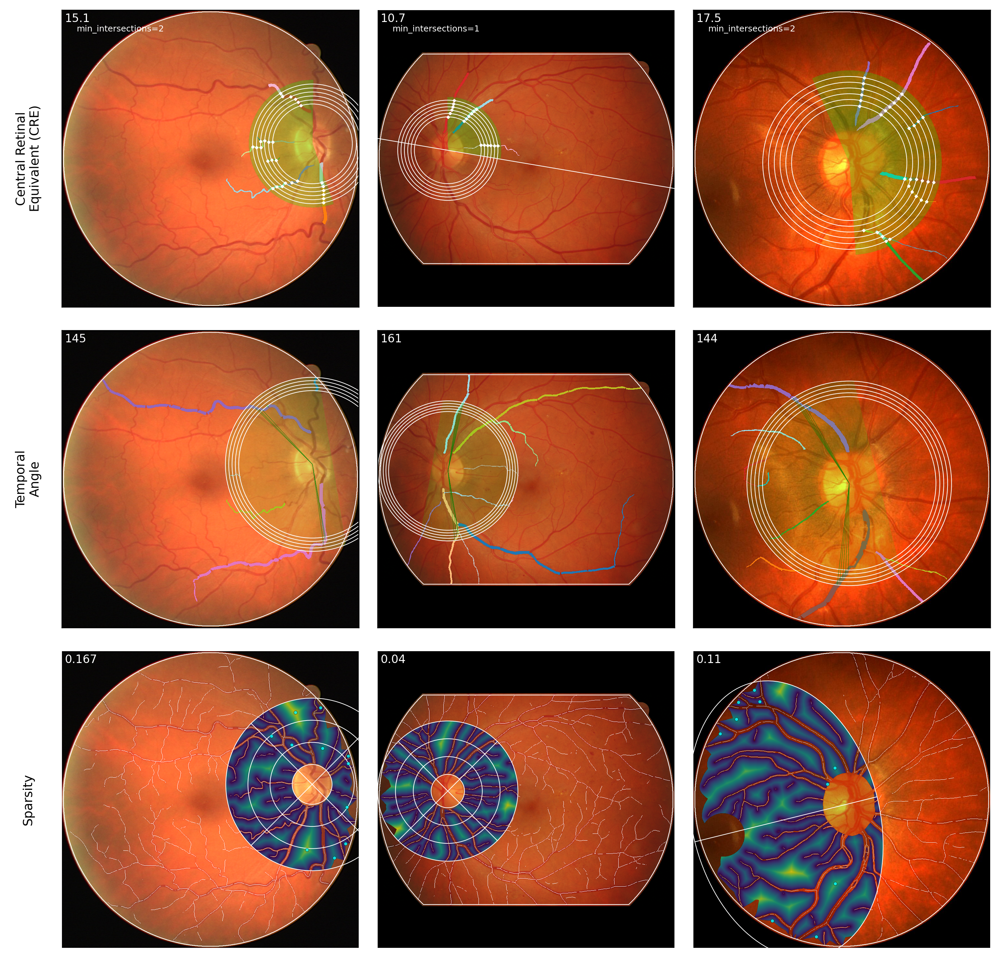
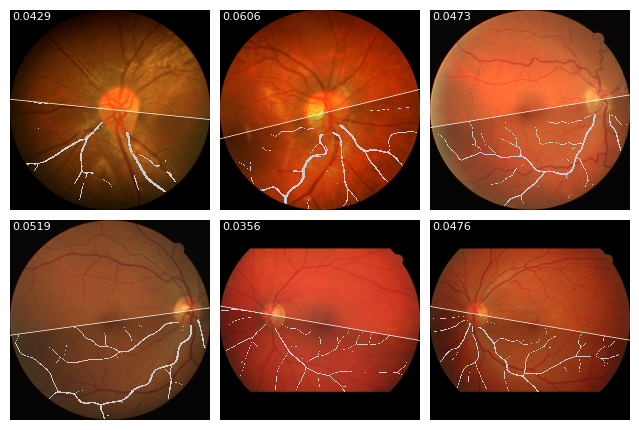
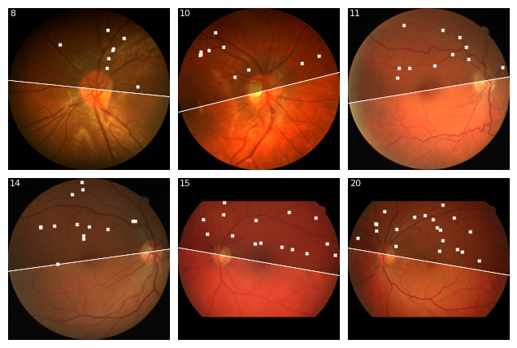
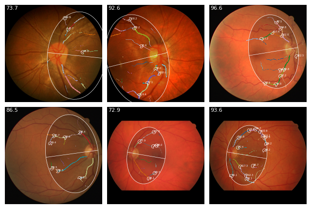
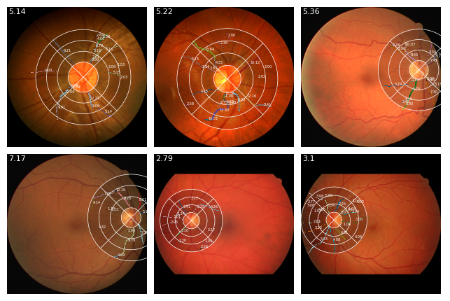
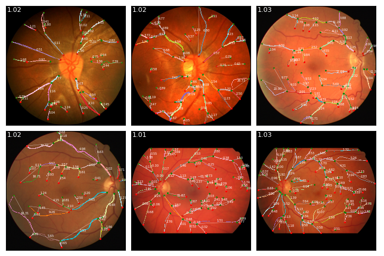
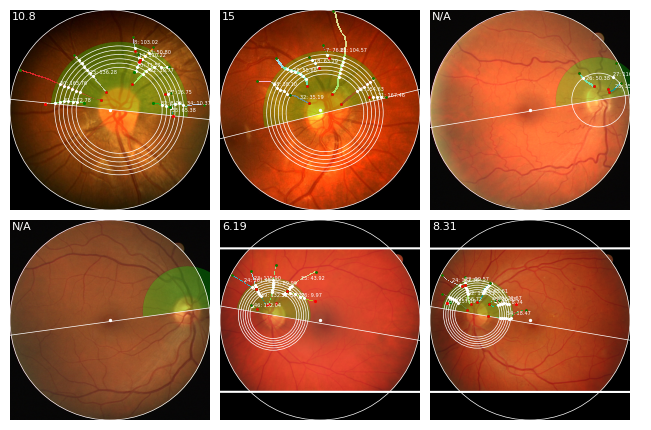
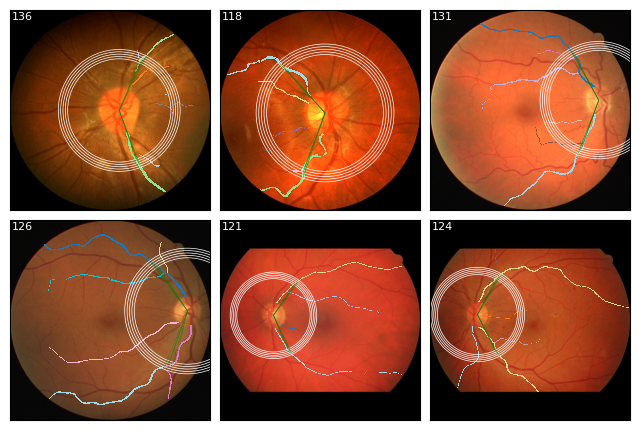
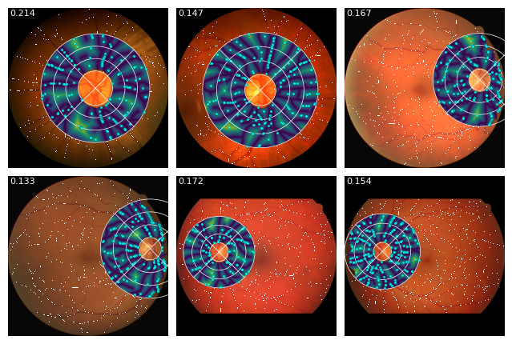

## Updates
- 10/06/2026: Updated README with more complete information on interpreting outputs and advanced use cases.
- 04/06/2026: We have fixed some remaining missing dependencies that meant run-models was not working correctly with vascx.

## VascX retinal vascular analysis

VascX was created to facilitate the extraction of retinal vascular biomarkers from color fundus image (CFI) segmentations. The instructions in this repository explain how to run the entire pipeline, which has two main parts:
- **CFI Segmentation.** Extraction of optic disc, vessels and artery vein segmentation and fovea locations. Our model weights are publicly available in a [huggingface repository](https://huggingface.co/Eyened/vascx). See instructions below for inference.
- **Biomarker computation.** Extraction of biomarkers from the segmentations.

## Features

- Currently supported biomarkers / features: Central Retinal Equivalents, Calibers, Artery-Vein Ratio, Vascular Density, Bifurcation Angles, Tortuosity, Sparsity, and others.
- Many of these biomarkers support multiple implementations and configuration arguments as detailed in [our manuscript](https://arxiv.org/abs/2602.08580). The code for each biomarker also specificies the supported options.
- VascX supports region-aware measurements, relative to the optic disc - fovea axis. If the region is not visible, the biomarker is not computed.
- VascX can generate visualisations for every biomarker.

<!-- <p align="center">
  
  
</p> -->

## Attribution

If you use VascX, please consider citing our open access papers / preprints:
- [VascX Models: Deep Ensembles for Retinal Vascular Analysis From Color Fundus Images](https://tvst.arvojournals.org/article.aspx?articleid=2810436)
Vargas Quiros, J. D., Liefers, B., van Garderen, K. A., Vermeulen, J. P., & Klaver, C. C. W. (2025). VascX Models: Deep Ensembles for Retinal Vascular Analysis From Color Fundus Images. Translational Vision Science & Technology, 14(7), 19-19.

- [retinalysis-vascx: An explainable software toolbox for the extraction of retinal vascular biomarkers](https://arxiv.org/abs/2602.08580)
Vargas Quiros, J. V., Beyeler, M. J., Vela, S. O., Center, E. R., Bergmann, S., Klaver, C. C. W., & Liefers, B. (2026). retinalysis-vascx: An explainable software toolbox for the extraction of retinal vascular biomarkers. arXiv preprint arXiv:2602.08580.


## Installation

To install the entire fundus analysis pipeline including fundus preprocessing, model inference code and vascular biomarker extraction:

1. Create a virtual environment, or otherwise ensure a clean environment.

2. Install torch and torchvision that match your cuda environment. For example:
```
pip install torch torchvision torchaudio  # pip and CUDA 12
conda install pytorch torchvision torchaudio pytorch-cuda=12.1 -c pytorch -c nvidia # conda and CUDA 12
pip install torch torchvision torchaudio --index-url https://download.pytorch.org/whl/cu118 # pip and CUDA 11
conda install pytorch torchvision torchaudio pytorch-cuda=11.8 -c pytorch -c nvidia # conda and CUDA 11
```

3. Install VascX:

```
pip install retinalysis-vascx
```

This checkout declares `retinalysis-inference==0.7.1` and
`retinalysis-enface==1.3.0` as dependencies; a release containing this metadata
will install them automatically.

Development release blocker: the published inference `0.7.1` wheel does not yet
contain `rtnls_inference.ensembles.predict_output`, used by this checkout.
Publish the compatible inference changes and update the exact pin before
releasing this VascX checkout. The current public VascX `1.4.0` also omits the
inference dependency; `tox -e public` reports that missing dependency.

> [!TIP]
> To be able to directly modify VascX code to eg. customise biomarkers or develop new ones, clone and install the Python package in development mode instead:
> ```
> git clone git@github.com:Eyened/retinalysis-vascx.git rtnls_vascx
> cd rtnls_vascx
> pip install -e .
> ```


## Usage

To run the two stages of VascX on a folder with input CFIs:

```
vascx run-models <PATH_TO_IMAGES> <PATH_TO_FOLDER_FOR_SEGMENTATIONS>
vascx calc-biomarkers <PATH_TO_FOLDER_FOR_SEGMENTATIONS> <PATH_TO_BIOMARKER_REPORT> --feature-set full_v3 --n-jobs 8
```

> [!TIP]
> Use `vascx run-models --help` or `vascx calc-biomarkers --help` to get help.

- `PATH_TO_IMAGES` should point to a folder with input CFIs in standard imaging formats. DICOM is supported via `pydicom`. Alternatively `PATH_TO_IMAGES` may be the path to a CSV file with `id` and `path` columns, and one image per row. If provided in this way, each `path` should be an absolute path to a valid image file and the corresponding unique `id` will be used to name the output and intermediate results for that image. This is useful when the source images are not all in a single folder.

  <details>
  <summary>Sample CSV file with inputs</summary>
  
  If you chose to use a CSV file as input to `run-models`, the format should be the following:
  ```
  id,path
  drive_left_22,/path/to/samples/fundus/original/DRIVE_22.png
  drive_right_40,/path/to/samples/fundus/original/DRIVE_40.png
  chasedb_left_08,/path/to/samples/fundus/original/CHASEDB1_08L.png
  chasedb_right_12,/path/to/samples/fundus/original/CHASEDB1_12R.png
  hrf_green_04,/path/to/samples/fundus/original/HRF_04_g.jpg
  hrf_dr_07,/path/to/samples/fundus/original/HRF_07_dr.jpg
  ```
  
  Note that paths should be absolute and IDs should be unique.
  </details>

- The folder `PATH_TO_FOLDER_FOR_SEGMENTATIONS` should initially be an empty or non-existent folder. The first stage (`run-models`) will write intermediate segmentations and other AI outputs to this folder.
- The same folder should be passed to the second stage as input as shown above. 
- `PATH_TO_BIOMARKER_REPORT` is an output folder containing the biomarker values, metadata, README, manifest, and sample plots.
- The `--feature-set` is used to specify a set of biomarkers to extract. The underscore spelling `--feature_set` remains available as an alias.
- The `--n-jobs` option indicates how many CPU jobs to start. For optimal performance, we recommend to set to the number of CPU threads available divided by two, as a rule of thumb.
- By default, `run-models` picks the first available CUDA GPU, Apple MPS acceleration, or CPU. Override this with `--device`, passing any string accepted by `torch.device` (for example `cuda:0`, `mps`, or `cpu`).
- An optional `--logfile PATH_TO_LOGFILE_TXT` can be added to store warnings.

### Example 

For example, to run VascX on the provided samples folder in our git repository:

```
git clone git@github.com:Eyened/retinalysis-vascx.git rtnls_vascx
cd rtnls_vascx
vascx run-models ./samples/fundus/original/ ./samples/fundus/segmentations
vascx calc-biomarkers ./samples/fundus/segmentations ./samples/fundus/biomarker_report --feature-set full_v3 --n-jobs 8 --naming resolved
```

## Outputs

`vascx calc-biomarkers` writes a self-contained output folder:

```text
PATH_TO_BIOMARKER_REPORT/
├── biomarkers.csv
├── biomarkers.metadata.csv
├── biomarkers.names.json
├── README.md
├── report.json
└── plots/
    └── <variable>/
        └── <image-id>.png
```

`biomarkers.metadata.csv` contains the machine variable, human-friendly display name, and description for every biomarker. `biomarkers.names.json` preserves the existing variable-to-display-name JSON format. By default, the report visualizes up to three input images; use `--report-samples` or repeated `--report-image` options to select them. Use `--no-report` to skip README, manifest, and plot generation while still writing biomarkers and metadata. Existing report-owned outputs are protected unless `--overwrite` is passed.

By default, CLI output uses feature-set-aware `resolved` names; pass `--naming canonical` to preserve the full canonical convention.
VascX parameter names typically follow the format:

```
[AGGREGATION]_[BIOMARKER]_[PARAMETERS]_[REGION]_[LAYER]
```

For example, for `median_tort_dist_etdrs_arteries`:

```
AGGREGATION = median - the vessel segments are aggregated using the median
BIOMARKER = tort (Tortuosity)
PARAMETERS = dist - this is the distance implementation of tortuosity
REGION = measured over the full ETDRS grid
LAYER = arteries - arterial biomarker - as opposed to veins or vessels (combined)
```

Some of the tokens may be ommited if they match defaults or if they do not apply. A CSV mapping between the selected biomarker names in the output CSV and publication-friendly display names can be generated with the same `--naming` option:

```
vascx write-mapping --feature_set full_v3 PATH_TO_MAPPING_CSV --naming resolved
```


`vascx run-models` will write segmentations and other model predictions to `PATH_TO_FOLDER_FOR_SEGMENTATIONS`, with the following structure:

```
/path/to/segmentations
  - preprocessed_rgb/ - preprocessed fundus images
  - artery_vein/ - artery-vein model segmentations
  - vessels/ - vessel model segmentations
  - disc/ - optic disc model segmentations
  - overlays/ - optional overlays showing the segmentations
  - bounds.csv - contains the bounds of the fundus image
  - fovea.csv - model predictions of the fovea locations for each image
  - quality.csv - model estimations of CFI quality
```

The folders above will contain images with matching filenames.

## Notebooks

As an alternative, we also provide notebooks for running the three stages:

1. Preprocessing. See [this notebook](./notebooks/0_preprocess.ipynb). This step is CPU-heavy and benefits from parallelization (see notebook).

2. Inference. See [this notebook](./notebooks/1_segment_preprocessed.ipynb). All models can be ran in a single GPU with >10GB VRAM.

3. Feature extraction. See [this notebook](./notebooks/2_feature_extraction.ipynb). This step is CPU-heavy again and benefits from parallelization (see notebook). Advanced users who need to pass custom parameters per image can use the alternative [advanced feature extraction notebook](./notebooks/advanced/2_feature_extraction_advanced.ipynb).

4. Post-processing and normalisation. See our [sample post-processing notebook](./notebooks/3_post_process.ipynb) showing how to post-process, and optionally normalise VascX exports.

> [!IMPORTANT]
> ### Biomarker post-processing and normalisation
> While several VascX biomarkers such as tortuosity are unitless, others such as vessel calibers or CREs measure distances. By default, VascX reports these distance measurements in pixels. If an explicit per-image `mm_per_pixel` value is provided, VascX uses it for ETDRS grid scaling and multiplies caliber and CRE biomarkers into millimeters. Some derived biomarkers such as artery-vein ratio (AVR) may also be computed in a post-processing stage as the ratio between caliber or CRE (recommended) measurements. The [sample post-processing notebook](./notebooks/3_post_process.ipynb) shows how to post-process and optionally normalise a VascX export.

## Advanced Usage

### Offline Usage

By default, `vascx run-models` loads model weights from the [Hugging Face model repository](https://huggingface.co/Eyened/vascx). This is convenient on connected workstations, but it will fail on offline clusters unless the model files are provided locally.

For offline use, download the VascX model files on a machine with internet access, copy them to the cluster, and arrange them in this directory layout:

```
/path/to/vascx-models/
  - quality/
    - quality.pt
  - artery_vein/
    - av_wsoft_patches_02_finetune.pt
  - vessels/
    - vessels_may26.pt
  - disc/
    - disc_may26.pt
  - fovea/
    - fovea_may26.pt
```

Then pass that directory to `run-models`:

```
vascx run-models /path/to/images /path/to/segmentations --model-dir /path/to/vascx-models
```

You can also set the model directory once in the environment:

```
export VASCX_MODEL_DIR=/path/to/vascx-models
vascx run-models /path/to/images /path/to/segmentations
```

For more control, provide individual model files directly with options `--quality-model`, `--av-model`, `--vessels-model`, `--disc-model` and `--fovea-model`. Per-model options take precedence over `--model-dir` and `VASCX_MODEL_DIR`.


### Skipping steps during re-execution

The `run-models` command has several `--no-*` flags that are intended for re-executing part of a pipeline after some outputs already exist. These flags skip work; they do not change where downstream steps look for inputs. If a later step needs an output from a skipped step, that output must already be present in the same `OUTPUT_PATH` layout.

For example, to reuse images that were already preprocessed, place them in the output folder before running `run-models` and pass `--no-preprocess`:

```
/path/to/segmentations
  - preprocessed_rgb/
    - image_001.png
    - image_002.png
```

```
vascx run-models ./samples/fundus/original/ /path/to/segmentations --no-preprocess
```

In `--no-preprocess` mode, model inputs are read from `/path/to/segmentations/preprocessed_rgb/*.png`. Files must be RGB PNG images named `<id>.png`; the `<id>` filename stem is used for all downstream outputs, such as `artery_vein/<id>.png`, `vessels/<id>.png`, `disc/<id>.png`, and rows in `fovea.csv` and `quality.csv`. These images should have the same preprocessed format produced by VascX/fundusprep, namely a square, model-ready fundus crop, normally 1024x1024 pixels.

`DATA_PATH` is still required to be an existing path for CLI compatibility, but when `--no-preprocess` is used its contents are not used as model inputs. If you plan to run `calc-biomarkers` on the output folder, keep or provide the matching `bounds.csv` from preprocessing as well.

The other skip flags follow the same idea:

- `--no-vessels` skips vessel and artery-vein segmentation. Reuse this only when `vessels/<id>.png` and `artery_vein/<id>.png` already exist for the IDs you need downstream.
- `--no-disc` skips optic disc segmentation. Reuse this only when `disc/<id>.png` already exists for the IDs you need downstream.
- `--no-fovea` skips fovea detection. Reuse this only when `fovea.csv` already exists if you will create overlays or run biomarker extraction.
- `--no-quality` skips image quality estimation. Reuse this when `quality.csv` already exists or when you do not need quality predictions.
- `--no-overlay` skips overlay creation. Reuse this when overlays already exist or when visualization overlays are not needed.

Only models for enabled steps are required. For example, a run with `--no-quality --no-fovea` does not need `quality/quality.pt` or `fovea/fovea_may26.pt`. If no local model options are provided, VascX keeps using the default Hugging Face model locations.

### Advanced extraction

For most datasets, the standard [feature extraction notebook](./notebooks/2_feature_extraction.ipynb) and `vascx calc-biomarkers` command are the simplest way to compute biomarkers. Advanced users can create `Retina` objects manually when they need to pass custom parameters per image, such as an explicit scaling factor `mm_per_pixel` from an acquisition platform. The [advanced feature extraction notebook](./notebooks/advanced/2_feature_extraction_advanced.ipynb) is an alternative to `2_feature_extraction.ipynb` that demonstrates this using the sample folder.

`mm_per_pixel` is interpreted as millimeters per pixel. When provided, VascX uses it to scale some grids defined in physical units (eg. ETDRS grid), and to convert caliber and CRE outputs from pixels to millimeters. Unitless features, densities, angles, and tortuosity values are not multiplied. If no `mm_per_pixel` value is provided, VascX keeps the legacy behavior: grid scaling is derived from the optic-disc to fovea distance using the 4.75 mm assumption, and caliber/CRE outputs remain in pixels. For full feature sets, also provide the ROI mask or preprocessing bounds; the advanced notebook shows how to convert VascX preprocessing bounds into an ROI mask.

<a id="code-changes"></a>
### Code changes

We welcome advanced users who want to do one of:
- Implement new biomarkers or variants of them
- Develop custom feature sets
- Contribute to the code in any other way

For that we recommend to clone VascX repo and install in development mode (-e flag) in a clean environment:

```
git clone git@github.com:Eyened/retinalysis-vascx.git rtnls_vascx
cd rtnls_vascx
pip install -e .
```

After that, you are able to locally:
- Change or add biomarker implementations by working on the [features folder](./vascx/fundus/features). Biomarkers must 
- Change or add "feature sets", or sets of biomarkers to extract from an image by working on the [feature_sets folder](./vascx/fundus/feature_sets).
- Keep using the extraction notebooks and the `vascx calc-biomarkers` command to run experiments.


## Implementation

VascX processes vessel segmentations through four main stages, each producing different data representations:

- **Input masks**: `np.ndarray[bool]` per layer; optic disc and fovea metadata from segmentation models.

- **Stage 1 - Binary/skeleton**: 
  - `binary`: filled vessel mask after disc masking
  - `binary_nodisc`: vessel mask without disc region
  - `skeleton`: skeletonized vessel centerlines using skimage skeletonization

- **Stage 2 - Undirected graph**: 
  - NetworkX `Graph` with skeleton pixels as nodes
  - `Segment` objects stored on edges containing skeleton points and geometric properties
  - Each segment represents a vessel segment between junction points

- **Stage 3 - Directed digraph**: 
  - NetworkX `DiGraph` with flow direction from optic disc outward
  - `trees`: root nodes representing vessel trees emanating from disc
  - `nodes`: `Endpoint` and `Bifurcation` objects with spatial positions
  - `segments`: directed vessel segments with computed properties (diameter, length, etc.)

- **Stage 4 - Resolved vessels**: 
  - Merged vessel graph after running vessel resolution algorithm
  - `resolved_segments`: final vessel segments after merging short segments
  - Segment-to-pixel mapping for spatial feature computation

Biomarker families use different representations: mask-based features use `binary`; topology features use `digraph` and `nodes`; morphological features use `segments` with computed diameters; spatial features use segment-to-pixel mappings.

## Biomarkers

VascX computes retinal vascular biomarkers from standardized representations (binary masks, undirected/directed graphs, resolved vessels). Below we describe each feature with the exact quantity being estimated and the equations used. Throughout, B denotes the stage‑1 binary vessel mask, S the set of eligible directed segments with lengths \(\ell_i\), and R an analysis region of interest; cardinalities count pixels, and distances are in pixels unless noted.

**VascularDensity.** The fraction of retinal area occupied by vessels in R, computed on the binary mask B:

$$
D = \frac{|B \cap R|}{|R|}.
$$



**BifurcationCount.** The count of branching points in the directed graph (stage‑3). Let $\mathcal{B}$ be the set of bifurcation nodes with positions $p_b$:

$$
C = \sum_{b \in \mathcal{B}} \mathbf{1}[p_b \in R].
$$



**BifurcationAngles.** For each bifurcation $b$ at position $p_b$, outgoing branch directions are estimated by sampling the branches' splines at distance $\delta$ from the node along each branch at points $q_1$ and $q_2$. Unit vectors $(u_b, v_b)$ are defined from the bifurcation point to the sample points:

$$
u_b = \frac{q_1 - p_b}{\|q_1 - p_b\|}, \quad v_b = \frac{q_2 - p_b}{\|q_2 - p_b\|},
$$

and the bifurcation angle is defined as the angle between these vectors:

$$
\theta_b = \arccos(u_b \cdot v_b), \quad \theta_b \in [0^\circ, 180^\circ].
$$

Angles exceeding 160° are discarded as non-bifurcating continuations. Summary statistics (e.g., mean/median) are reported across valid nodes.



**Caliber.** For each segment $i$, diameters are sampled along a spline fitted to its skeleton by projecting spline normals to the vessel boundary on B. The per‑segment diameter is the median along its arclength. The reported caliber aggregates over eligible segments (length $\ell_i \ge \ell_{\min}$):

$$
C = g\big(\{ d_i : i \in S \}\big),
$$

where \(g\) is a robust statistic (typically the median).



**Tortuosity.** Three complementary measures are provided per segment (or per resolved vessel). Let $L_{\text{arc},i}$ be arclength and $L_{\text{chord},i}$ the end‑to‑end Euclidean distance.

- Distance factor:

$$
T_i^{\text{DF}} = \frac{L_{\text{arc},i}}{L_{\text{chord},i}}.
$$

- Curvature‑based measure, using planar curvature $\kappa_i(s)$ and OD–fovea distance $d_{ODF}$ for scale normalization:

$$
T_i^{\kappa} = \frac{1}{L_{\text{arc},i}} \int_0^{L_{\text{arc},i}} \big|\kappa_i(s)\big| \, ds \; \cdot \; d_{ODF}.
$$

- Inflection count (number of curvature sign changes along the centerline):

$$
T_i^{\text{INF}} = N^{(i)}_{\text{inflections}}.
$$

When reporting a single score over multiple segments, length‑weighted aggregation may be used for normalization:

$$
T_{\text{tot}} = \sum_{i \in S} \left( \frac{\ell_i}{\sum_{j \in S} \ell_j} \right) t_i,
$$

with $t_i$ any of the measures above.



**CRE (Central Retinal Equivalents).** Concentric circles centered at the optic disc are intersected with the vessel network. At each radius $r$, up to $M$ crossings with the largest segment median diameters are retained and recursively reduced via the Hubbard rule with a modality‑dependent constant $c$ (arteries: 0.88; veins: 0.95):

$$
 d \leftarrow c\,\sqrt{d_1^2 + d_2^2}
$$

applied pairwise until a single equivalent caliber $d_r$ remains. The final CRE is the median of $\{d_r\}$ across radii.



**TemporalAngle.** On each concentric circle of radius \(r\), the two dominant temporal vessels are identified by diameter and spatial continuity. The angle at the disc center is

$$
\theta_r = \angle\big(\overline{OD\,p_1(r)},\, \overline{OD\,p_2(r)}\big),
$$

and the reported value is the median over radii.



**Sparsity.** Let $\mathrm{DT}(x)$ represent the distance transform over $R$, ie. the normalized Euclidean distance to the nearest vessel pixel (scaled by $d_{ODF}$). Over pixels in R we report either the mean or the largest local maximum:

$$
S_{\text{mean}} = \frac{1}{|R|} \sum_{x \in R} \mathrm{DT}(x), \qquad
S_{\max} = \max_{x \in R \cap \text{local maxima}} \mathrm{DT}(x).
$$



**VarianceOfLaplacian.** For the fundus image $I$ (grayscale), compute the discrete Laplacian $L = \Delta I$. Image sharpness is summarized as the variance over R:

$$
Var\{ L(x) : x \in R \}.
$$

**DiscFoveaDistance.** With optic disc center $c_{OD}$ and fovea position $p_f$,

$$
 d_{ODF} = \lVert c_{OD} - p_f \rVert_2.
$$


## Feature localisation

VascX localises feature computations using anatomical references and predefined grids:

- **Anatomical anchoring**
  - The optic disc mask and fovea position orient geometry (e.g., OD–fovea axis) and define a retinal mask.
  - All region masks are intersected with the retinal mask; features operate only on visible retina.

- **Predefined grids** (`rtnls_enface/rtnls_enface/grids`)
  - `EllipseGrid`: ellipse centered midway between disc and fovea, major axis along OD–fovea. Fields: `FullGrid`, `Superior`, `Inferior`.
  - `CircleGrid`: circle along the OD–fovea axis (`center` places it between disc and fovea; radius is `radius_multiplier × OD–fovea distance + disc radius`). Fields: `FullGrid`, `Superior`, `Inferior`.
  - `ETDRSGrid`: classic ETDRS layout with rings (`Center`, `Inner`, `Outer`), quadrants (`Superior`, `Inferior`, `Nasal`, `Temporal`, plus `Left`/`Right`), and subfields (`CSF`, `SIM`, `NIM`, `TIM`, `IIM`, `SOM`, `NOM`, `TOM`, `IOM`).
  - `HemifieldGrid`: superior/inferior half-planes split relative to the OD–fovea axis. Fields: `FullGrid`, `Superior`, `Inferior`.
  - `DiscCenteredGrid`: disc-anchored rings (`inner`, `center`, `outer`) and quadrants (`superior`, `inferior`, `nasal`, `temporal`, plus `left`/`right`), taking laterality into account.

- **Bounds and visibility (CFI bounds)**
  - For a chosen field, the platform evaluates the fraction within bounds using `grid_field_fraction_in_bounds` (and `grid_field_masks_and_fraction`).
  - If the fraction in-bounds is too small (typically < 0.5), many features skip computation and return `None` to avoid out-of-frame bias.
  - Visualizers plot the requested field overlayed on the image; computations always respect in-bounds masking.

Ready-to-run feature sets are available under `vascx/fundus/feature_sets` and can be selected by name. Use `extract_in_parallel` when only an in-memory DataFrame is needed:

```python
from vascx.utils.analysis import extract_in_parallel

df = extract_in_parallel(examples, "full_v3", n_jobs=8)
```

Use `extract_biomarkers_to_folder` to write the same report bundle as the CLI:

```python
from vascx.utils.analysis import extract_biomarkers_to_folder

df = extract_biomarkers_to_folder(
    examples,
    "full_v3",
    "biomarker_report",
    n_jobs=8,
    naming="resolved",
    report_sample_size=3,
)
```

Inputs may be dictionaries accepted by `Retina.from_file` or already constructed `Retina` objects. Pass `report_retinas` to visualize a separate, explicitly selected set of representative images, or `generate_report=False` to skip README, manifest, and plot generation.

## Testing

Edit [`tests/settings.py`](tests/settings.py) to configure all numerical test
tolerances: biomarker percentage changes, segmentation Dice, fovea coordinate
errors, extraction timing, CLI timeouts, and floating-point boundary allowance.
Each setting has a comment explaining its meaning and units. Local and public
runs use the same file. The biomarker pytest option overrides its configured
default for that run. Per-feature-set YAML files contain schema exceptions only.

`test_biomarker_report.py` generates real reports for `macula_centered` and
`od_centered`, with light checks for report files and plots. `test_feature_plotting.py`
renders the individual feature plots for the same two sets. Outputs are saved in
pytest's temporary directories; use `--basetemp=/tmp/vascx-test-output` to choose a
predictable location (pytest clears that directory on each run).
The inference test is `tests/test_inference.py::test_inference`; its selection
marker remains `cli_e2e`.

Run tests against your local editable installation:

```bash
pip install -e ".[test]"
pytest
```

The same tests can target the public package in a separate environment:

```bash
pip install tox
tox -e public
# Select a particular published VascX version:
VASCX_VERSION=1.2.3 tox -r -e public
```

`public` installs VascX from PyPI with its published dependencies, checks dependency
consistency, and prints package versions and import paths. It copies the tests and
sample data into an isolated working directory without the local package source.
It runs both regression groups by default. Tests and reference values are identical
in local and public modes; only the installed target changes. The version above is
an example; select an existing release. To validate historical releases, use tests
and references from the corresponding source tag when their CLI/schema differs.

The two stages are tested independently through the installed `vascx` executable:

- **Biomarker computation** (`reference`): `calc-biomarkers` reads the fixed sample
  segmentations and metadata. Each feature set's canonical CSV columns are compared
  against `tests/reference/*.parquet`, allowing up to 5% change per image by default.
  Report files are checked too. This test does not run inference.
  Multiple value mismatches are summarized per biomarker with means over failing
  images (excluding NaN), plus the image with the largest absolute difference.
  Schema messages explicitly identify variables present only in the reference
  or only in the current output.
- **AI inference** (`cli_e2e`): `run-models` reads `samples/fundus/original` and
  compares vessel, artery/vein and disc masks against the stored sample masks
  (Dice >= 0.99 for each foreground class), and fovea coordinates within 2 pixels.
  It also checks output IDs, files and finite quality logits. Quality scores do
  not yet have a numerical reference baseline. Model weights are downloaded from
  Hugging Face or reused from its cache; the CLI selects the available device.
  `VASCX_MODEL_DIR` can select a fixed local model release in both modes.

Run the same selection locally or publicly:

```bash
pytest -m reference
tox -e public -- -m reference

pytest -m cli_e2e
tox -e public -- -m cli_e2e

pytest -m "reference or cli_e2e"
```

Inference runs by default in both local and public tests and loads real models.
To exclude it, use `pytest -m "not cli_e2e"` or
`tox -e public -- -m "reference and not cli_e2e"`.
The old `--run-cli-e2e` option remains accepted for compatibility but is unnecessary.
Public runs deliberately do not add missing runtime
dependencies separately: incomplete published dependency metadata should fail.

When a reviewed change intentionally updates biomarker outputs, refresh the local
references explicitly (never as part of public-package validation):

```bash
pytest --accept-vascx-reference -m reference
```

Inference uses the existing sample masks and fovea CSV as references and does not
rewrite them. Changes to model weights or preprocessing may require a separately
reviewed update of those inputs and the corresponding biomarker references.

Regression tests explicitly request `canonical` names, and reference metadata records
`naming: canonical`. VascX CLI commands and Python extraction/reporting APIs default
to `resolved` names; pass `naming="canonical"` in Python or `--naming canonical`
on the CLI when canonical output is needed. Reference column renaming preserves
all stored numerical values, including existing schema and numerical mismatches.

The biomarker regression threshold is configurable at test time:

```bash
pytest -m reference --vascx-max-percent-change 5
tox -e public -- -m reference --vascx-max-percent-change 5
# Include inference as well:
tox -e public -- -m "reference or cli_e2e" --vascx-max-percent-change 5
```

For each biomarker on each image, a numerical comparison fails when
`abs(current - reference) > (threshold / 100) * abs(reference)`.
Exactly 5% passes at the default threshold, including integer-valued biomarkers.
The threshold must be finite and non-negative; use `0` for exact numerical equality.
Zero references require zero current values. Matching NaNs pass, but transitions
between missing and measured values fail, as do changed infinities. Missing images,
variables, and reference files still fail independently of the numerical threshold.
YAML overrides control schema compatibility; historical numeric tolerance entries
are no longer used. The percentage option does not change inference mask/landmark tolerances.
